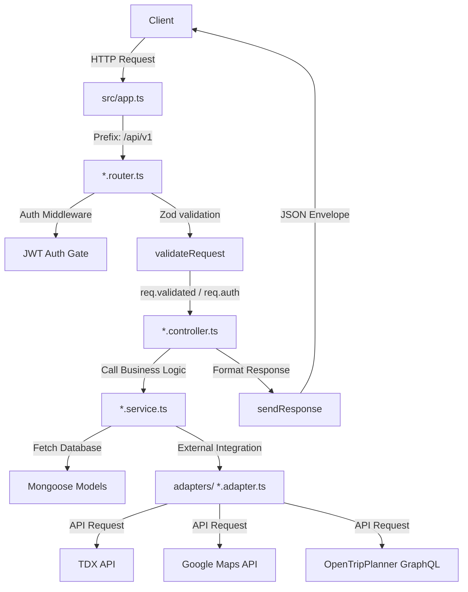
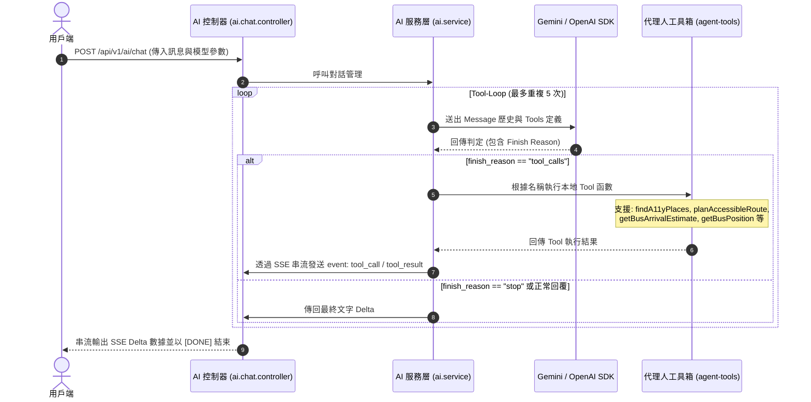

<div align="center">
    <h1>accessible-map-backend</h1>

[](https://www.typescriptlang.org/)
[](https://nodejs.org/)
[](https://expressjs.com/)
[](https://opentripplanner.org/)
[](LICENSE.md)

**無障礙地圖多模態路徑規劃與即時交通數據整合 API 服務**

[快速開始](#快速開始) · [API 接口](#api-接口分組說明) · [開發指令](#開發與建構指令)

</div>

---

## 目錄

- [專案概述](#專案概述)
  - [核心技術特色](#核心技術特色)
  - [無障礙導航引擎與標準導航引擎對比](#無障礙導航引擎與標準導航引擎對比)
- [系統架構與請求流程](#系統架構與請求流程)
- [OpenTripPlanner 路由引擎技術細節](#opentripplanner-路由引擎技術細節)
- [AI 代理人架構與工具循環](#ai-代理人架構與工具循環)
- [知識檢索與向量記憶機制](#知識檢索與向量記憶機制)
- [快速開始](#快速開始)
  - [1. 前置需求](#1-前置需求)
  - [2. 安裝依賴](#2-安裝依賴)
  - [3. 環境變數設定](#3-環境變數設定)
  - [4. 匯入空間與大眾運輸數據](#4-匯入空間與大眾運輸數據)
  - [5. 啟動服務](#5-啟動服務)
  - [使用 Docker Compose 部署](#使用-docker-compose-部署)
- [開發與建構指令](#開發與建構指令)
- [API 接口分組說明](#api-接口分組說明)
- [測試與驗證](#測試與驗證)
- [貢獻者名單](#貢獻者名單)
- [參與方式](#參與方式)
- [授權條款 (MIT License)](#授權條款-mit-license)

---

## 專案概述

### 背景與痛點

在都市交通運輸系統中，身心障礙者與行動不便市民（如輪椅使用者、推車使用者）之出行導航面臨空間資料破碎化與非連續性問題。現有的主流導航服務（如 Google Maps、Apple Maps）缺乏三維空間幾何與站體內部阻礙物（如階梯、天橋、無坡道之人行道）之細粒度建模，且無法動態感知無障礙設施（如捷運電梯）之即時妥善率，導致規劃之路徑常出現物理中斷。

### 系統設計與解決方案

本專案為基於 TypeScript 與 Express.js 建構的後端 REST API 服務。系統整合多個不同來源的空間與即時數據，在持久層（MongoDB）中導入 OpenStreetMap (OSM) 空間無障礙拓撲關係、捷運站體內部之 GTFS-pathways 階層式路徑網絡。動態層則透過與交通部 TDX 平台對接，串接公車、軌道運輸（捷運、台鐵、高鐵）之動態定位與捷運電梯即時妥善率。環境感知層則整合中央氣象署（CWA）氣象警報、環保署空氣品質指標（AQI）及路口監視器（CCTV）之即時資料，提供行前環境狀況感知。

### 運行效益

透過統一的 REST 接口，本系統能規劃符合無障礙通道約束之步行與大眾運輸混合路徑，有助於減少行動不便者之路線探路成本與物理風險。

---

### 核心技術特色

- **多模態混合路線規劃引擎 (Multi-Modal Routing Engine)**：整合捷運、台鐵、高鐵、公車與步行路網，為輪椅使用者提供無障礙路徑規劃。
- **站體內部轉乘路徑導航 (Station Interior Pathways Navigation)**：支援 GTFS-pathways 與 levels 標準，建立捷運站內部跨樓層「電梯至電梯」之導航關係。
- **AI 代理人對話與工具呼叫 (AI Agent Service)**：基於大語言模型，支援自然語言導航意圖解析、路線解說與工具呼叫。
- **道路障礙通報機制 (Hazard Reporting & Expiry System)**：提供道路障礙通報系統，包含時間窗自動失效機制、社群確認機制與 JWT 身份驗證安全機制。
- **環境感測數據聚合 (Environmental Sensor Aggregation)**：整合氣象警報、即時路口 CCTV 影像與空氣品質指標（AQI），作為行前環境狀態的評估參考。
- **架構設計與穩定性防護 (Architecture & Fault Tolerance)**：採用單向層次架構（Clean Architecture），配合 Zod 進行網關層資料驗證，並針對外部 OpenTripPlanner (OTP2) 服務提供熔斷器防護設計，降低外部服務中斷對系統的影響。

---

### 無障礙導航引擎與標準導航引擎對比

| 分析指標         | 標準導航引擎                             | accessible-map-backend                             |
| :--------------- | :--------------------------------------- | :------------------------------------------------- |
| **物理通道約束** | 導引至階梯、天橋、手扶梯或缺乏緩坡之路徑 | 物理約束檢修：100% 無障礙電梯與緩坡道路徑          |
| **三維內部網絡** | 將站體簡化為二維座標，忽略垂直高度與阻礙 | 站內多樓層感知：實作 GTFS-pathways 跨樓層路徑規劃  |
| **動態狀態更新** | 依據靜態時刻表或標準交通擁堵預估         | 動態定位融合：即時整合大眾運輸車輛位置與電梯妥善率 |
| **環境安全風險** | 無法感知天候異動或臨時道路物理障礙       | 動態熔斷路由：自動避開社群通報障礙與天候警報區     |

---

## 系統架構與請求流程

本專案嚴格遵循**單向層次架構 (Clean Backend Architecture)**，藉由明確的分層邊界與倒置依賴，確保系統具備高可測試性與模組低耦合性。



關於架構邊界、分層設計以及遷移細節，請參閱 [docs/reports/architecture-audit.md](docs/reports/architecture-audit.md)。

---

## OpenTripPlanner 路由引擎技術細節

專案透過與獨立運行的 OpenTripPlanner 2.x (OTP2) 服務對接，提供多模態（公車、地鐵、鐵路、步行）的無障礙最佳路線計算。

### 1. GraphQL API 整合與數據對齊

系統藉由發送 GraphQL 請求至 `{OTP_BASE_URL}/otp/gtfs/v1` 查詢符合條件的行程（Itineraries）。獲取數據後，系統會將 OTP2 內部的路段（Legs）與步驟（Steps）重新對齊映射為專案定義的 `AccessibleRoute` 格式，無縫導入後續的評分（Scoring）與解說管道。

### 2. Snap 站點投影演算法

為了解決真實空間座標（經緯度）與軌道系統、公車系統實體站點的精確關聯，路由模組實作了投影對齊演算法：

- **半徑約束**：設定 `SNAP_RADIUS_M = 500`（500公尺）的定位尋檢半徑。
- **座標匹配**：將起訖點的幾何經緯度進行近鄰搜索，投影對齊至實體捷運站（MetroStation）、火車站（TrainStation）或公車站（BusStop），解決戶外步行與站體入口的物理銜接問題。

### 3. 電路熔斷器機制 (Circuit Breaker)

為了保障後端在外部 OTP2 服務故障時不發生級聯故障，路由模組實作了獨立的狀態熔斷器（`planBreaker` 與 `railGeomBreaker`）：

- **失敗閾值**：若對 OTP2 引擎的 API 呼叫連續失敗達到 `BREAKER_THRESHOLD = 3` 次，熔斷器會自動開啟（Tripped）。
- **冷卻等待**：熔斷器開啟後，會進入 `BREAKER_COOLDOWN_MS = 60000`（60秒）的冷卻恢復期。在此期間內，系統將停止對 OTP2 發送請求，路由規劃端點將直接回傳 `503 Service Unavailable` 錯誤代碼與無障礙語意訊息，避免阻塞整個 HTTP 處理線程。

---

## AI 代理人架構與工具循環

系統於 `/api/v1/ai/chat` 接口實作了基於 Server-Sent Events (SSE) 的串流 AI 代理人服務。代理人除了處理對話，更透過工具循環（Tool-Loop）機制與後端的核心領域邏輯進行深度整合。

### 工具循環運作流程



### 支援工具與其他端點

- **代理人工具箱 (agent-tools)**：包含 `findGooglePlaces` (地點搜尋)、`findA11yPlaces` (無障礙地點查詢)、`planAccessibleRoute` (路線規劃)、`getBusArrivalEstimate` (公車到站預估)、`getBusPosition` (公車定位)、`getAirQuality` (空氣品質查詢) 以及 `getA11yFacilityDetails` (無障礙設施詳情)。
- **語意意圖解析 (`POST /api/v1/ai/intent`)**：使用語言模型分析用戶輸入，提取導航的起訖點、出發時間與規劃偏好。
- **路徑語意解說 (`POST /api/v1/ai/explain`)**：接收導航路由輸出，將複雜的路徑階層與轉乘步驟轉換為易讀的自然語言說明。

---

## 知識檢索與向量記憶機制

為了擴展 AI 代理人對台北市無障礙環境、專屬法規及即時通報的記憶容量，系統實作了向量資料庫檢索（RAG）作為代理人的知識記憶體。

### 1. 向量特徵提取 (Embedding Adapter)

系統採用 Google Gen AI SDK 之 `text-embedding-004` 作為基礎向量化模型：

- **維度規格**：對傳入的無障礙知識文字片段進行特徵提取，生成 768 維度之稠密特徵向量。
- **批次處理**：實作 `embedBatch` 方法以支援大數據量匯入時的異步批次轉換。

### 2. 向量持久化與持久層架構 (Chroma DB Adapter)

系統選用 ChromaDB 作為向量存儲引擎（預設運行於 `localhost:8100` 連接埠）：

- **專屬集合**：在持久層中建立名為 `accessibility_knowledge` 的向量集合。
- **元數據關聯**：寫入時將文字片段、特徵向量與包含來源網址、文章分類與標題的 `metadata` 物件綁定。

### 3. 語意關聯性檢索 (Search & Ranking Logic)

當用戶與 AI 代理人對話涉及空間知識或無障礙指引時，檢索模組會被觸發：

- **向量度量計算**：對查詢語句進行即時特徵提取，在 ChromaDB 集合內計算餘弦相似度距離。
- **相關度評分排序**：藉由公式 `score = 1 - distance` 計算相關度評分，並篩選出前三筆 (Top-K) 最相關的上下文片段，即時注入至語言模型的 System Prompt 中，以此建立具備事實依據的記憶檢索機制。

---

## 快速開始

### 1. 前置需求

確保您的系統已安裝 **Node.js (>= 20)** 與 **npm**。您還需要一個運行中的 **MongoDB** 執行個體，以及選擇性安裝的 **Redis**（用於 API 流量限制）。

### 2. 安裝依賴

複製專案並安裝必要的 npm 套件：

```bash
npm install
```

### 3. 環境變數設定

複製環境變數範例檔案：

```bash
cp .env.example .env
```

請在 `.env` 檔案中設定您的金鑰與伺服器參數（詳細變數說明請參閱 [CLAUDE.md](CLAUDE.md)）：

```env
PORT=5000
NODE_ENV=development
CORS_ORIGIN=http://localhost:3000
GOOGLE_MAPS_API_KEY=your_google_maps_key
GEMINI_API_KEY=your_gemini_key
JWT_ACCESS_SECRET=your_jwt_access_secret
JWT_REFRESH_SECRET=your_jwt_refresh_secret
DATABASE_URL=your_mongodb_connection_uri
TDX_CLIENT_ID=your_tdx_id
TDX_CLIENT_SECRET=your_tdx_secret
CWA_API_KEY=your_cwa_key
```

### 4. 匯入空間與大眾運輸數據

在運行前，需要先執行指令將 TDX、GTFS 與 OpenStreetMap 的空間數據匯入至您的 MongoDB 資料庫：

```bash
# 匯入 OpenStreetMap 無障礙設施標籤
npm run import:osm

# 匯入台北市無障礙廁所與身障車位資料
npm run import:bathrooms
npm run import:parking

# 匯入所有 GTFS 軌道運輸網絡資料 (包含捷運站內通道、電梯與樓層)
npm run import:gtfs-all

# 匯入即時公車站點、路線以及捷運車站資訊
npm run import:tdx-stops
npm run import:tdx-bus-routes
npm run import:tdx-metro
```

### 5. 啟動服務

啟動開發模式伺服器（支援 nodemon 與 dotenvx 熱重載）：

```bash
npm run dev
```

伺服器將會啟動於 `http://localhost:5000`。您可以造訪 `http://localhost:5000/docs` 查看本地互動式 API 文件 (Scalar UI)。

### 使用 Docker Compose 部署

本專案提供完整的 Docker Compose 設定檔，能一鍵建立包含 Node API、MongoDB、OpenTripPlanner (OTP2) 導航引擎與 ChromaDB 向量資料庫的整合容器：

```bash
# 建構並背景啟動所有服務容器
docker compose up -d
```

---

## 開發與建構指令

我們使用 npm 腳本來管理所有日常開發與建構工作：

| 腳本名稱             | 終端指令                 | 說明                                    |
| -------------------- | ------------------------ | --------------------------------------- |
| `npm run dev`        | `dotenvx run -- nodemon` | 開發模式啟動 (支援熱重載與環境變數載入) |
| `npm run build`      | `tsc`                    | 編譯 TypeScript 原始碼至 `dist/` 資料夾 |
| `npm start`          | `node dist/server.js`    | 啟動生產模式伺服器                      |
| `npm run clean`      | `rimraf dist`            | 清除建構產出的編譯檔案                  |
| `npm test`           | `vitest run`             | 執行所有單元測試與整合測試              |
| `npm run test:watch` | `vitest`                 | 以互動式監控模式執行測試                |

---

## API 接口分組說明

所有路由均註冊於 `/api/v1` 前綴下，並透過 Scalar 自動生成說明文件。

| 路徑前綴                        | 控制器層                      | 技術職責                                                | 安全認證要求                      |
| ------------------------------- | ----------------------------- | ------------------------------------------------------- | --------------------------------- |
| `/api/v1/user/*`                | `user.controller.ts`          | 處理使用者帳戶生命週期、JWT 簽發與重新整理雙 Token 機制 | 混合 (敏感端點需 JWT Bearer 驗證) |
| `/api/v1/transit/*`             | `transit.controller.ts`       | 查詢 TDX 實時公車與軌道運輸到站預估與空間定位           | 公開 (Public API)                 |
| `/api/v1/a11y/accessible-route` | `accessible-route.controller` | 執行多源數據融合之路徑規劃算法，支援 OTP2 引擎調用      | 公開 (Public API)                 |
| `/api/v1/a11y/environment`      | `environment.controller.ts`   | 調用氣象署與環保署介面，聚合即時 CCTV 串流影像          | 公開 (Public API)                 |
| `/api/v1/a11y/hazard/*`         | `hazard-report.controller.ts` | 處理道路障礙通報之寫入、更新與確認機制                  | 混合 (寫入需 JWT 驗證)            |
| `/api/v1/air/*`                 | `air.controller.ts`           | 即時監測點空氣品質指數（AQI）數據查詢                   | 公開 (Public API)                 |
| `/api/v1/ai/*`                  | `ai.controller.ts`            | Gemini 意圖識別、說明生成與 Tool-Loop 智能對話引擎      | 公開 (Public API)                 |

伺服器健康檢查請求範例：

```bash
curl http://localhost:5000/health
```

成功回應之 JSON 格式（使用統一的 `sendResponse` 回應信封）：

```json
{
  "ok": true,
  "status": "success",
  "code": 200,
  "message": "Server is running",
  "data": {
    "timestamp": "2026-06-26T15:42:00.000Z"
  }
}
```

---

## 測試與驗證

本專案使用 **Vitest** 進行單元測試與路由整合測試。

- 路由整合測試使用 **supertest** 模擬真實 Express 路由請求，不需真正連接資料庫或第三方網路。
- 執行測試套件：
  ```bash
  npm test
  ```
- 測試檔案與程式碼同級，遵循 `*.test.ts` 的命名規則。

---

## 授權條款

本專案基於 [MIT](./LICENSE.md) 開源發布，您可以自由使用、修改並散布本軟體。
