# AI 模組更新與 Agent 串流 Function Calling 功能實作文檔
## Functional Specification — OpenAI-Compatible Streaming Agent (v1.1)

**版本**：v1.1  
**狀態**：Superseded（原始設計記錄）— 工具目錄與 result 格式之**現行**規格見 [`AI_AGENT_TOOLS_REFERENCE.md`](./AI_AGENT_TOOLS_REFERENCE.md)。本文件為 v1.1 的 6-tool 原始設計，且 SDK / SSE 細節已與現況漂移（現況改用原生 `@google/genai`，工具增至 17 個），**請勿據此實作**。  
**日期**：2026-06-11  
**作者**：Antigravity AI  

---

## 目錄

1. [系統概述與目標](#1-系統概述與目標)
2. [現有程式庫功能分析與 Tool 規劃](#2-現有程式庫功能分析與-tool-規劃)
3. [Agent 系統架構](#3-agent-系統架構)
4. [API 介面規格](#4-api-介面規格)
5. [核心流程與狀態管理](#5-核心流程與狀態管理)
6. [工具定義與 Zod 規格 (OpenAPI)](#6-工具定義與-zod-規格-openapi)
7. [實作 Roadmap 與任務清單](#7-實作-roadmap-與任務清單)

---

## 1. 系統概述與目標

本功能設計旨在為「無障礙混合式交通導航系統」更新其 AI 模組，使其轉化為符合 **Agent 架構** 的對話引擎。

### 1.1 核心需求與升級目標
1. **OpenAI 格式相容性**：請求與回應格式需與 OpenAI Chat Completions API 規格一致。
2. **SSE 串流輸出 (Streaming)**：支援 `stream: true` 逐字串流回傳。
3. **後端代理的工具執行 (Orchestrated Function Calling)**：在串流過程中，由後端攔截並執行本地工具，並將結果送回模型生成最終回答。
4. **現有程式庫功能 Tool 化**：深入分析現有程式庫中的資料庫與外部 API 整合模組，升級現有工具並導入新工具，賦予 Agent 強大的即時查詢與路線規劃能力。
5. **API 文件同步更新**：同步更新 `Scalar API UI` (`/docs`)。

### 1.2 環境變數配置 (Env Configuration)
為了提高系統部署的靈活性，AI 模組之 API 基礎網址 (Base URL) 與模型名稱皆需透過環境變數控制，並使用官方的 `openai` SDK 進行對接：

1. **`GEMINI_API_URL`** (選填)：自訂 AI API 基礎 URL (Base URL)。若有透過 Proxy 轉接、企業內部網關或特定區域 Endpoint 時設定（例如 `https://generativelanguage.googleapis.com/v1beta/openai`）。若未設定，預設可為 Gemini API 的 OpenAI 相容端點。
2. **`GEMINI_MODEL`** (選填)：預設使用之模型名稱（例如 `gemini-2.5-flash` 或 `gpt-4o`）。後端會優先讀取此環境變數，若未設定則 fallback 至預設值 `gemini-2.5-flash`。

於 `.env` 設定範例：
```env
# AI 模組設定
GEMINI_API_KEY=AIzaSy...
GEMINI_API_URL=https://generativelanguage.googleapis.com/v1beta/openai
GEMINI_MODEL=gemini-2.5-flash
```

後端 `openai` SDK 初始化範例：
```typescript
import OpenAI from "openai";

const openai = new OpenAI({
  apiKey: process.env.GEMINI_API_KEY || process.env.OPENAI_API_KEY,
  baseURL: process.env.GEMINI_API_URL || "https://generativelanguage.googleapis.com/v1beta/openai",
});
const model = process.env.GEMINI_MODEL || "gemini-2.5-flash";
```

---

## 2. 現有程式庫功能分析與 Tool 規劃

透過對現有模組的分析，我們規劃出 6 個核心工具，分為「現有工具升級」與「新增功能 Tool 化」兩大類：

### 2.1 現有工具升級規劃

#### Tool 1: `findA11yPlaces` (無障礙設施查詢 - 升級版)
* **現有實作** (`chatbot-tools.ts:L91-165`)：僅搜尋 `A11y` (捷運出口電梯) 與 `BathroomModel` (無障礙廁所)。
* **分析與升級規劃**：
  - 現有的 `a11y.controller.ts` 中有導入 `OsmA11y` 模型（包含更豐富的斜坡、無障礙通路、導盲磚等 OpenStreetMap 標記數據）。
  - **升級後**：我們將 `findA11yPlaces` 擴展為同時查詢 `A11y`、`BathroomModel` 以及 `OsmA11y` 三個資料集，提供更全面的無障礙地標回報。

#### Tool 2: `planAccessibleRoute` (無障礙路線規劃 - 升級版)
* **現有實作** (`chatbot-tools.ts:L167-204` 的 `planRoute`)：僅比對起終點經緯度並回傳坐標，並未在後端真正計算路線。
* **分析與升級規劃**：
  - `accessible-route.controller.ts` 內已實作極為強大的 `findAccessibleRoutes` 服務，它能與 `OpenRouteService (ORS)`、`GTFS`、`TRTC 捷運室內圖` 整合，計算出最適合輪椅/年長/視障使用者的無障礙複合交通路線，並附帶詳細步行引導與 A11y 評分。
  - **升級後**：當 Agent 判斷需要規劃路線時，直接在後端呼叫 `findAccessibleRoutes()`，將**實際的路線名稱、轉乘次數、預估時間與無障礙警告**返回給 Agent，讓 Agent 能提供真正具備專業度與準確度的路線建議。

---

### 2.2 新增功能 Tool 化規劃

#### Tool 3: `getBusArrivalEstimate` (即時公車到站預估 - 新功能 Tool 化)
* **分析與規劃**：
  - 現有 `transit.controller.ts` 的 `getBusData` 已經與 `TDX 台灣交通資料平台` 介接，能根據出發站、抵達站與公車路線名稱，動態計算該公車往特定方向的即時預估到站時間 (ETA)。
  - **Tool 化**：封裝此功能為 Tool，當用戶問及「307公車還有多久會到？」或「怎麼搭公車去...」時，Agent 可即時取得公車到站時間，提供動態導航建議。

#### Tool 4: `getBusPosition` (即時公車車牌位置查詢 - 新功能 Tool 化)
* **分析與規劃**：
  - 現有 `transit.controller.ts` 中的 `getRealtimeBusPosition` 能透過車牌號碼與路線名稱，向 TDX 查詢公車當下的即時 GPS 座標。
  - **Tool 化**：封裝此功能為 Tool，使用於對話中「那班輪椅友善公車現在開到哪了？」等即時追蹤情境。

#### Tool 5: `getAirQuality` (即時空氣品質查詢 - 新功能 Tool 化)
* **分析與規劃**：
  - 現有 `air.controller.ts` 的 `getAirQualityInfo` 能將經緯度反查行政區，並向環保署 (EPA IoT) API 讀取該行政區的即時 PM2.5 數據。
  - **Tool 化**：封裝此功能為 Tool。在輪椅使用者、長輩或呼吸道敏感使用者出發前，Agent 可主動或被動查詢目的地空氣品質，提供防護建議（例如「今日大安區 PM2.5 偏高，建議出門配戴口罩」）。

#### Tool 6: `getA11yFacilityDetails` (無障礙設施詳細資訊查詢 - 新功能 Tool 化)
* **分析與規劃**：
  - 現有 `a11y.controller.ts` 的 `getA11yPlace` 可透過 OpenStreetMap 的 `osmId` 陣列，查閱該設施的完整底層標記（Tag）細節。
  - **Tool 化**：封裝此功能為 Tool。若 Agent 在規劃的路線中發現某個 OSM 設施（例如特定坡道或電梯），可進一步使用此工具查詢該設施的細部備註或長度限制，以回答更精準的問題。

---

### 2.3 Agent Tool 映射表

| 工具名稱 (Tool Name) | 原有程式庫對應模組 | 主要輸入參數 | 回傳數據說明 |
| :--- | :--- | :--- | :--- |
| `findA11yPlaces` | `src/modules/a11y/a11y.controller.ts` 的 `nearbyA11y` 邏輯 | `query`, `latitude`, `longitude`, `range` | 附近捷運無障礙出口、無障礙廁所及 OSM 無障礙設施物件陣列 |
| `planAccessibleRoute` | `src/modules/accessible-route/accessible-route.service.ts` | `origin`, `destination`, `mode`, `departureTime` | 混合交通（公車/捷運/步行）的完整路線清單、轉乘細節、無障礙評分及風險警告 |
| `getBusArrivalEstimate` | `src/modules/transit/transit.controller.ts` 的 `getBusData` 邏輯 | `routeName`, `departureStop`, `arrivalStop`, `latitude`, `longitude` | 指定公車路線方向及出發站的即時預估到站時間 (分/秒) |
| `getBusPosition` | `src/modules/transit/transit.controller.ts` 的 `getRealtimeBusPosition` | `plateNumber`, `routeName`, `latitude`, `longitude` | 指定公車目前 GPS 座標與位置狀態 |
| `getAirQuality` | `src/modules/air/air.controller.ts` 的核心 logic | `latitude`, `longitude` | 該位置所在行政區的 PM2.5 指數、空氣品質等級與文字建議 |
| `getA11yFacilityDetails` | `src/modules/a11y/a11y.controller.ts` 的 `getA11yPlace` 邏輯 | `osmId` | 設施的完整 Tags 與註記資料 |
| `findGooglePlaces` | `src/modules/chatbot/chatbot-tools.ts` | `query`, `latitude`, `longitude` | Google Maps 第三方地點、地標搜尋結果 |

### 2.4 新增工具定義 (OpenAI SDK ChatCompletionTool 規格)

為確保 `src/config/ai/tool.ts` 實作之一致性，以下為新增工具之 OpenAI 規格參數定義：

```typescript
// Tool 3: getBusArrivalEstimate
const getBusArrivalEstimateTool: OpenAI.Chat.Completions.ChatCompletionTool = {
  type: "function",
  function: {
    name: "getBusArrivalEstimate",
    description: "查詢特定公車路線在指定站點的即時預估到站時間 (ETA)。",
    parameters: {
      type: "object",
      properties: {
        routeName: { type: "string", description: "公車路線名稱，例如：'307'、'紅2'" },
        departureStop: { type: "string", description: "起點/出發站牌名稱" },
        arrivalStop: { type: "string", description: "終點/抵達站牌名稱" },
        latitude: { type: "number", description: "使用者當前經緯度座標之緯度 (選填)" },
        longitude: { type: "number", description: "使用者當前經緯度座標之經度 (選填)" }
      },
      required: ["routeName", "departureStop", "arrivalStop"]
    }
  }
};

// Tool 4: getBusPosition
const getBusPositionTool: OpenAI.Chat.Completions.ChatCompletionTool = {
  type: "function",
  function: {
    name: "getBusPosition",
    description: "根據公車車牌號碼與路線名稱，查詢該公車目前的即時 GPS 位置與行駛狀態。",
    parameters: {
      type: "object",
      properties: {
        plateNumber: { type: "string", description: "車牌號碼，例如：'EAL-1234'" },
        routeName: { type: "string", description: "公車路線名稱，例如：'307'" },
        latitude: { type: "number", description: "使用者當前緯度 (選填)" },
        longitude: { type: "number", description: "使用者當前經度 (選填)" }
      },
      required: ["plateNumber", "routeName"]
    }
  }
};

// Tool 5: getAirQuality
const getAirQualityTool: OpenAI.Chat.Completions.ChatCompletionTool = {
  type: "function",
  function: {
    name: "getAirQuality",
    description: "根據經緯度查詢該地區的即時空氣品質指標 (PM2.5) 與健康防護建議。",
    parameters: {
      type: "object",
      properties: {
        latitude: { type: "number", description: "目標地區之緯度" },
        longitude: { type: "number", description: "目標地區之經度" }
      },
      required: ["latitude", "longitude"]
    }
  }
};

// Tool 6: getA11yFacilityDetails
const getA11yFacilityDetailsTool: OpenAI.Chat.Completions.ChatCompletionTool = {
  type: "function",
  function: {
    name: "getA11yFacilityDetails",
    description: "根據 OpenStreetMap (OSM) 的 osmId 查詢無障礙設施的完整詳細 Tags 與底層註記資料。",
    parameters: {
      type: "object",
      properties: {
        osmId: { type: "string", description: "設施的 OSM ID，可以是單個或以逗號分隔的多個 ID，例如：'node/123456'" }
      },
      required: ["osmId"]
    }
  }
};
```

---

## 3. Agent 系統架構

後端作為 **Agent Orchestrator**，負責協調用戶、OpenAI SDK (對接 LLM) 以及本地工具庫。

### 3.1 系統互動序列圖

```mermaid
sequenceDiagram
    autonumber
    actor Client as 前端客戶端
    participant Orchestrator as Backend (Agent Orchestrator)
    participant LLM as LLM API (via OpenAI SDK)
    participant Tools as 本地 Tools 集 (DB, TDX, Air, Route Engine)

    Client->>Orchestrator: POST /api/v1/ai/chat (stream: true, messages)
    Orchestrator->>LLM: 發送對話內容與工具定義 (openai.chat.completions.create)
    
    rect rgb(30, 40, 50)
        note right of Orchestrator: 第一階段：工具決策與執行迴圈 (可重複多次)
        LLM-->>Orchestrator: 串流返回：要求呼叫 Tool (例如 planAccessibleRoute)
        note over Orchestrator: 檢測到 tool_calls，暫緩對用戶的文本串流
        Orchestrator->>Client: [SSE Event] 串流通知工具開始執行 (event: tool_call)
        Orchestrator->>Tools: 呼叫對應本地 Tool 函數
        Tools-->>Orchestrator: 返回結構化資料 (例如 實際路線細節/公車即時時間)
        Orchestrator->>Client: [SSE Event] 串流通知工具執行完成與資料 (event: tool_result)
    end

    rect rgb(40, 30, 50)
        note right of Orchestrator: 第二階段：總結回覆生成
        Orchestrator->>LLM: 附帶工具回傳再次呼叫 (openai.chat.completions.create)
        loop 逐字串流
            LLM-->>Orchestrator: 串流返回：最終解答文本
            Orchestrator->>Client: [SSE Event] 串流發送 OpenAI 格式 delta (choices.delta.content)
        end
    end

    Orchestrator->>Client: [SSE Event] data: [DONE] (關閉連接)
```


---

## 4. API 介面規格

### 4.1 請求端點
* **端點**：`POST /api/v1/ai/chat`
* **Content-Type**：`application/json`

**請求範例**：
```json
{
  "model": "gemini-3-flash-preview",
  "stream": true,
  "temperature": 0.2,
  "messages": [
    {
      "role": "user",
      "content": "我坐輪椅，想從台北車站去台北101，現在怎麼去最方便？"
    }
  ],
  "userLocation": {
    "latitude": 25.0478,
    "longitude": 121.5170
  }
}
```
---

### 4.2 回應規格：串流模式 (`stream: true`)
後端會以 `text/event-stream` 格式逐步回傳資料。

* **Status**: `200 OK`
* **Content-Type**: `text/event-stream`

#### 4.2.1 正常文本輸出 Chunk 範例：
```text
data: {"id":"chatcmpl-a11y-1234567890","object":"chat.completion.chunk","created":1718092800,"model":"gemini-3-flash-preview","choices":[{"index":0,"delta":{"content":"您"},"finish_reason":null}]}
```

#### 4.2.2 串流工具調用狀態 (SSE 自訂 metadata 事件)：
為了在符合 OpenAI 格式的前提下，將後端執行的工具結果（例如 Place API 搜尋到的地點陣列、規劃出的路線經緯度）同步傳遞給前端，我們在串流中嵌入自定義工具回應事件。

前端應使用標準 `EventSource` 或 `fetch-event-source` 分別監聽 `message`、`tool_call`、`tool_result` 以及 `error` 事件：

* **工具開始呼叫事件 (event: `tool_call`)** — 通知前端顯示 Loading 狀態與正在呼叫的工具資訊：
  ```text
  event: tool_call
  data: {"name": "planAccessibleRoute", "arguments": {"origin": "台北車站", "destination": "台北101", "mode": "wheelchair"}}
  ```

* **工具呼叫結果事件 (event: `tool_result`)** — 傳遞工具執行完畢之結構化資料：
  ```text
  event: tool_result
  data: {"name": "planAccessibleRoute", "result": {"ok": true, "routes": [...]}}
  ```

* **錯誤處理事件 (event: `error`)** — 於串流中途發生錯誤時回傳：
  ```text
  event: error
  data: {"code": 500, "message": "Failed to execute local tool: Database Timeout"}
  ```

* **結束信號 (event: `message`)**：
  ```text
  data: [DONE]
  ```

---

## 5. 核心流程與狀態管理

後端作為中間協調代理，需管理與 LLM 互動的多輪對話狀態。

### 5.1 對話歷程映射
由於本系統後端改採官方之 `openai` SDK 進行呼叫，前端傳入之 `messages` 格式與 OpenAI Chat Completions 規範 100% 一致。

因此，**後端無需進行任何複雜的格式映射或轉換**，可以直接將 `messages` 陣列傳送給 `openai.chat.completions.create`。

唯一需要處理的是在對話開始前，將**系統提示詞 (System Instruction)** 與選填的**使用者位置 context** 附加於訊息歷史中：
1. **System Prompt**：若 `messages` 陣列首項無 `role: "system"` 訊息，後端應自動於最前端插入預設之 System Prompt。
2. **Location Context**：若前端有提供 `userLocation`，後端可將座標資訊隱式嵌入 System Prompt 或首條 User Message 中，以供 Tools 使用。
---

## 6. 工具定義與 Zod 規格 (OpenAPI)

為了讓 Scalar UI 同步渲染此 Agent Chat 介面，我們必須在 `src/modules/ai/ai.schema.ts` 中定義 Zod Schemas。

### 6.1 Zod 結構定義範例
```typescript
export const ToolCallSchema = z.object({
  id: z.string(),
  type: z.literal("function"),
  function: z.object({
    name: z.string(),
    arguments: z.string() // 參數 JSON 字串
  })
});

export const ChatMessageSchema = z.object({
  role: z.enum(["system", "user", "assistant", "tool"]),
  content: z.string().nullable().optional(),
  name: z.string().optional(), // 當 role 為 tool 時必填，對應工具名稱
  tool_calls: z.array(ToolCallSchema).optional(),
  tool_call_id: z.string().optional()
});

export const AgentChatRequestSchema = z.object({
  model: z.string().optional().default("gemini-3.5-flash"),
  messages: z.array(ChatMessageSchema),
  stream: z.boolean().optional().default(false),
  temperature: z.number().optional().default(0.2),
  userLocation: z.object({
    latitude: z.number(),
    longitude: z.number()
  }).optional() // 供工具解析使用之基準經緯度座標
});
```

---

## 7. 實作 Roadmap 與任務清單

### Phase 1：基礎架構與路由設定
- [ ] 於 `src/modules/ai` 目錄下建立新 controller `ai.chat.controller.ts`。
- [ ] 於 `src/modules/ai/ai.router.ts` 註冊 `router.post("/chat", ...)` 端點。

### Phase 2：現有功能 Tool 封裝與升級
- [ ] 升級 `findA11yPlaces`：加入對 `OsmA11y` 資料庫的查詢，回傳更細緻的無障礙障礙物/設施。
- [ ] 升級 `planAccessibleRoute`：串接 `accessible-route.service.ts` 的 `findAccessibleRoutes`，回傳真實計算的無障礙路徑。
- [ ] 實作 `getBusArrivalEstimate`、`getBusPosition`、`getAirQuality` 與 `getA11yFacilityDetails` 本地 Tool 函數。
- [ ] 在 `src/config/ai/tool.ts` 中註冊以上所有 OpenAI 格式的 `ChatCompletionTool` 定義。

### Phase 3：Agent 迴圈與工具執行
- [ ] 實作 OpenAI SDK 串接（安裝 `openai` 依賴、於 `src/config/ai.ts` 初始化 `OpenAI` 客戶端）。
- [ ] 實作後端 Agent 攔截與執行本地工具之邏輯 (`executeLocalTool`)。
- [ ] 支援多回合工具調用迴圈（當 OpenAI 串流回傳 `tool_calls` 時，執行本地 Tool，將結果作為 `role: "tool"` 寫入歷史紀錄並重試請求，直至無 `tool_calls`）。

### Phase 4：串流輸出與 SSE 實作
- [ ] 實作 Express 串流回應標頭配置（`Content-Type: text/event-stream`、停用快取）。
- [ ] 將 OpenAI SDK 串流文字透明傳遞給用戶端（保留其原生的 JSON chunk 格式）。
- [ ] 實作自定義的 `event: tool_call`、`event: tool_result` 與 `event: error` SSE 事件發送邏輯。

### Phase 5：API 文件與驗證
- [ ] 在 `src/modules/ai/ai.schema.ts` 註冊 `/ai/chat` 的 OpenAPI Path。
- [ ] 啟動專案，透過 `/docs` 介面驗證 API 文檔。
